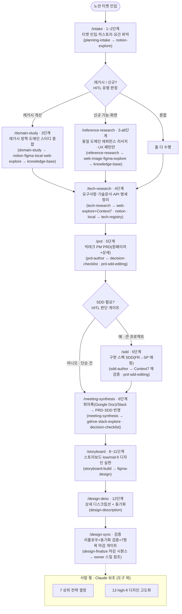

# myJob Planning Automation

PM/PD 제품 기획 워크플로우를 자동화하는 **Claude Code 플러그인**입니다. 이 레포는 *도구*(플러그인)만 담으며, 마켓플레이스로 팀에 배포됩니다. **실제 기획 산출물은 이 레포가 아니라 별도의 "기획 워크스페이스 레포"에 생성**됩니다.

> 목표: 반복 노동은 Claude가 주도하고, **전략적 결정만 사람이** 내리는 구조.

## 무엇을 자동화하나

현업 13단계 기획 워크플로우 중 반복 노동을 Claude가 주도합니다.

| 단계 | 담당 | 상태 |
|---|---|---|
| 1 티켓 인입 · 2 요건 파악(+레거시/신규 유형 판정) | 🤖 Claude | ✅ |
| 3 도메인 스터디 **또는** 레퍼런스 리서치(신규 제품) | 🤖 Claude | ✅ |
| 4 기술 리서치 | 🤖 Claude | ✅ |
| 5 PRD / (조건부)SDD | 🤖 Claude · 🧑 결정 | ✅ |
| 6 회의록 종합(Google Doc/Slack → PRD/SDD 반영) | 🤖 보조 · 🧑 확인 | ✅ |
| 7 의사결정 브리프(옵션·트레이드오프·추천) | 🤖 보조 · 🧑 결정 | ✅ 기존 도구로 수행(`decision-checklist`+`meeting-synthesis`) |
| 8~13 Figma 스토리보드 · low/mid-fi 디자인 · 디스크립션 | 🤖 Claude · 🧑 확정 | ✅ (high-fi 고도화·디자인 확정은 사람) |

> 현재 릴리스는 **단계 1~13 전체의 자동화 범위**를 제공합니다. 사람 몫(7 상위 전략의 *최종 결정*, 13 high-fi 디자인 확정)만 Claude가 보조하며, 7단계 의사결정 브리프는 전용 스킬 없이 `decision-checklist`+`meeting-synthesis`로 처리합니다.

## 핵심 개념 (먼저 이해하면 좋은 것)

- **도구 ↔ 산출물 2-레포 분리**: 플러그인(이 레포)은 *방법론·템플릿*을, 기획 산출물은 *워크스페이스 레포*에 만듭니다. 커맨드는 항상 **현재 작업 디렉토리(워크스페이스)** 에 산출물을 씁니다.
- **소스 레지스트리** `.planning/sources.json`: 흩어진 레거시/기술 자료의 위치(노션·Figma·로컬·웹·Slack·Drive)를 등록해두면, 리서치 단계가 자동 순회합니다. (스키마: [`config/sources.example.json`](plugins/product-planning/config/sources.example.json))
- **파일 지식베이스(KB)** `.planning/knowledge-base/`: 수집한 정책·도메인·API를 **출처와 함께 구조화 저장**(팀 공유·재사용). 벡터DB가 아니라 grep/Read로 조회하는 파일 KB.
- **사람 확인 게이트(HITL)**: 전략·취향 결정은 Claude가 단정하지 않고 멈춰 묻습니다 — ① 레거시/신규 유형 판정 ② Figma 탐색 페이지 선정 ③ SDD 작성 여부 ④ 회의록 모호 항목 ⑤ 의사결정 체크리스트 최종 결정.

## 도구 구성

아래 플로우차트는 각 도구가 **어떤 워크플로우 작업**을 맡는지, 그리고 **인입 후 레거시/신규 분기**가 어떻게 갈라지는지를 보여줍니다. 둥근 노드는 시작/HITL 분기, 사각 노드는 `커맨드 · 단계`와 그 안에서 쓰는 스킬(괄호)입니다. **8~13 디자인 단계는 PRD 확정 후 명시적 별도 호출**(`/storyboard`·`/design-desc`·`/design-sync`)로 동작합니다(아래 본문 참조). 점선 박스는 **사람 몫**(7 상위 전략 결정·13 high-fi 확정)으로 Claude는 보조만 합니다. 7단계 의사결정 브리프(옵션·추천)는 별도 도구 없이 `decision-checklist`+`meeting-synthesis`로 생성·반영합니다.



**커맨드 (11)** — 워크플로우 진입점

| 커맨드 | 단계 | 설명 |
|---|---|---|
| `/new-planning <티켓-URL>` | 1~5 | 인입→(유형 분기)리서치→PRD→(조건부)SDD 전체 파이프라인 |
| `/intake <티켓-URL>` | 1~2 | 티켓 인입·파싱 + 레거시/신규 유형 판정 |
| `/domain-study` | 3 | (레거시) 레거시 정책·도메인 종합 |
| `/reference-research` | 3-alt | (신규) 동일 도메인 레퍼런스 분석 — **UI 학습 금지·UX 패턴만** |
| `/tech-research` | 4 | 요구사항·기술 문서·API 명세 정리 |
| `/prd` | 5 | 빅테크 PM 방법론 PRD(원페이저+상세+의사결정 체크리스트) |
| `/sdd` | 5 | (게이트 통과 시) 구현 스펙 SDD |
| `/meeting-synthesis` | 6 | 회의록(Google Doc)/Slack 스레드 → PRD/SDD 반영 |
| `/storyboard` | 8~11 | PRD→Figma 화면 실현(모드 A 운영/B 백지) + 비주얼 게이트 |
| `/design-desc` | 12 | 화면 디스크립션 작성(뱃지 매칭) + 디자인 동기화 |
| `/design-sync` | 11/13 | 디스크립션↔디자인 동기화 검증(claim↔노드 대조표) |

**스킬 (21)** — 방법론(커맨드 없이 대화 중 자동 트리거 가능)

- **워크플로우(오케스트레이션, 7)**: `planning-intake` · `domain-study` · `reference-research` · `tech-research` · `prd-author` · `sdd-author` · `meeting-synthesis`
- **소스별 읽기(7)**: `notion-explore` · `figma-explore` · `local-source-ingest` · `web-explore` · `image-explore` · `slack-explore` · `gdrive-explore`
- **디자인 쓰기(4, 단계 8~13)**: `figma-design`(쓰기 원시·3세트 구조·골격·swap/심볼/폰트) · `storyboard-build`(화면 실현·모드 A/B·비주얼 게이트) · `design-description`(디스크립션+동기화·뱃지 매칭·대조표) · `design-finalize`(마감 시퀀스 공용 단일 소스 — 리플로우→hug→겹침→7항목 검수→동기화, 방법은 owner 스킬 참조)
- **공용(3)**: `knowledge-base`(파일 KB 쓰기) · `decision-checklist`(기획 공백→추천안→최종결정) · `prd-sdd-editing`(문서 편집 불변식)

**서브에이전트**: `research-agent` — 대량/병렬 자료 수집을 격리 컨텍스트에서 수행(방법은 읽기 스킬 참조, 요약만 반환).
**템플릿/설정/훅**: `templates/`(산출물 양식, `design/` 디자인 양식 포함) · `config/sources.example.json`(소스 스키마) · SessionStart 훅(워크스페이스·KB 감지) + 디자인 단계 관측 훅(Figma 쓰기·파일쓰기 로그 → 워크스페이스 `.planning/logs`).

---

## 워크플로우 단계별 자동화 가이드

각 단계는 `/new-planning` 으로 한 번에 돌리거나, 아래 단계별 커맨드로 따로 실행할 수 있습니다.
모든 작업은 **워크스페이스 레포에서** 실행하세요(`cd <workspace>`).

### 1~2단계 · 티켓 인입 + 요건 파악 + 유형 판정 ✅
- **커맨드**: `/intake <노션-티켓-URL>`
- **도구셋**: 스킬 `planning-intake` → 읽기 `notion-explore` · MCP `Notion` · 템플릿 `project-brief`.
- **하는 일**: 노션 티켓을 fetch하고 연결 트리(상위·하위·relation)를 **예산 안에서** 탐색(`notion-explore`), 담당자·코멘트 resolve, 요건/일정/링크 구조화.
- **사람 확인(HITL)**: **레거시 개선 vs 신규 기능 유형 판정** — Claude가 1차 판정하고, 애매하면 사용자에게 확인 → 이 결정이 3단계 경로를 확정합니다.
- **산출물**: `engagements/<slug>/00-project-brief.md` (유형·3단계 경로·요건·이해관계자·미해결 의사결정 포함).

### 3단계 · 도메인 스터디(레거시) ✅  또는  레퍼런스 리서치(신규)
유형 판정 결과에 따라 갈립니다.

**(레거시 개선)** `/domain-study`
- **도구셋**: 스킬 `domain-study` → 읽기 `notion-explore`·`figma-explore`·`local-source-ingest`·`web-explore` · 쓰기 `knowledge-base` · 서브에이전트 `research-agent`(대량 읽기 격리) · MCP `Notion`·`Figma` · 템플릿 `domain-study`.
- **하는 일**: `sources.json` 의 레거시 소스를 소스별 읽기 스킬로 수집 → KB 적재 → 자립형 문서 종합.
  - 노션(`notion-explore`) · Figma(`figma-explore`) · 로컬 zip/폴더(`local-source-ingest`) · 웹(`web-explore`).
- **사람 확인(HITL)**: **Figma 탐색 페이지 선정** — 파일에 페이지가 여럿이라, 미지정 시 어떤 페이지를 볼지 질문. index-first·콘텐츠 노드 우선·**페이지 단위 직렬**·완료 체크포인트.
- **입력(sources.json)**: `notion.policy_dbs`/`domain_pages`, `figma.legacy_files`(+`explore_pages`), `local.doc_dirs`/`archives`.
- **산출물**: `research/domain-study.md` + KB `policy-registry.yaml`·`entity-glossary.md`·`source-manifest.yaml`.

**(신규 제품)** `/reference-research`
- **도구셋**: 스킬 `reference-research` → 읽기 `web-explore`·`image-explore`·`figma-explore` · 쓰기 `knowledge-base` · 서브에이전트 `research-agent` · MCP `Figma` · 템플릿 `reference-research`.
- **하는 일**: 동일 도메인 레퍼런스(공개 웹 `web-explore` · 화면 캡쳐 이미지 `image-explore` · Figma 레퍼런스)를 분석해 ① 도메인 주요 기능 ② 필요한 기획/정책 ③ **UX 패턴** 정리.
- **원칙**: **UI(비주얼/컴포넌트 외형)는 학습하지 않음** — UX 패턴만 추출하고 UI는 우리 서비스에 맞게 재디자인.
- **입력(sources.json)**: `reference.web`, `reference.images`, `figma.reference_files`.
- **산출물**: `research/reference-research.md` + `source-manifest`.

### 4단계 · 기술 리서치 ✅
- **커맨드**: `/tech-research`
- **도구셋**: 스킬 `tech-research` → 읽기 `web-explore`(+`Context7` 최신 검증)·`notion-explore`·`local-source-ingest` · 쓰기 `knowledge-base`(`tech-registry`) · 서브에이전트 `research-agent` · MCP `Context7`·`Notion` · 템플릿 `tech-research`.
- **하는 일**: 신규 개발에 필요한 기술 요건·API 명세 수집 — 공개 웹/문서(`web-explore`, public `notion.site`는 `notion-fetch`로) · 사내 노션(`notion-explore`) · 로컬 zip의 PDF 등(`local-source-ingest`) · 라이브러리는 **Context7로 최신 검증**.
- **저장 정책**: 내부/파트너 **API·연동 스펙**은 KB `tech-registry.yaml`(version+as_of+요건매핑)에. 서드파티 **라이브러리/SDK는 캐시 금지** — manifest에 버전+as_of만, **사용 시점(특히 SDD 확정 전) Context7 재검증**.
- **입력(sources.json)**: `web.tech_docs`/`context7_libraries`, `local.archives`/`doc_dirs`.
- **산출물**: `research/tech-research.md`(요건↔기술 매핑) + KB `tech-registry.yaml`.

### 5단계 · PRD / (조건부)SDD ✅
- **커맨드**: `/prd` → (필요 시) `/sdd`
- **도구셋(PRD)**: 스킬 `prd-author` → `decision-checklist`(기획 공백) · `prd-sdd-editing`(갱신 시) · 템플릿 `PRD`. (입력: `research/*.md` + KB. **진입 게이트**: `research/tech-research.md` 부재 시 멈추고 사용자 확인.)
- **도구셋(SDD)**: 스킬 `sdd-author` → `decision-checklist`(기술 결정) · `prd-sdd-editing` · `Context7` 재검증 · 템플릿 `SDD`.
- **하는 일(PRD)**: **글로벌 빅테크 PM 방법론**(Working Backwards·Cagan·Lenny·Shreyas)으로 PRD 작성 — 상단 **원페이저 요약** + 하단 **상세 요구사항**(유저스토리 US-n / 기능명세 FR-n + 수용기준 Given/When/Then / NFR). 사람·AI(다운스트림 디자인 자동화) 모두가 읽도록 구조화.
- **기획 공백 처리(`decision-checklist`)**: 아직 못 정한 정책/기획/기술 요건은 본문에 `추가 기획 필요 → D-n` 마커 + 하단 **의사결정 체크리스트**(추천안 → **임시 채택**으로 초안 진행 → 결정상태 ☐/☑ · **최종 결정안** 컬럼). 나중에 결정되면 영향 범위(FR/§)를 따라 본문을 빠르게 교체.
- **사람 확인(HITL)**: **PRD↔SDD 판단 게이트** — 멀티기능·복잡 아키텍처면 *왜 PRD만으로 부족한지* 설명하고 SDD 작성 여부를 확인. 단순 건은 PRD만으로 종료.
- **하는 일(SDD, 게이트 통과 시)**: PRD FR→스펙 매핑, 데이터 모델·상태머신·API·엣지 케이스. 라이브러리는 확정 전 Context7 재검증. 기존 문서 편집은 `prd-sdd-editing` 불변식(ID 보존·출처/변경이력) 준수.
- **산출물**: `PRD.md` (+ `SDD.md`).

### 6단계 · 회의록 종합 ✅
- **커맨드**: `/meeting-synthesis --gdoc <URL>` 또는 `--slack <스레드-URL>`
- **도구셋**: 스킬 `meeting-synthesis` → 읽기 `gdrive-explore`·`slack-explore` · `decision-checklist`(최종 결정 반영) · `prd-sdd-editing`(편집 불변식) · MCP `Google Drive`·`Slack` · 템플릿 `meeting-log`.
- **하는 일**: Gemini 자동 회의록(Google Doc, `gdrive-explore`) 또는 Slack 스레드(`slack-explore`)를 읽고, 현재 PRD/SDD와 대조해 **수정·추가·삭제·갱신** 반영. 결정된 의사결정(D-n)은 체크리스트 **최종 결정안 + ☑**으로 확정하고 영향 범위 따라 본문 갱신.
- **사람 확인(HITL)**: **자의적 해석 금지** — 회의 내용 중 이해/맥락이 모호하면 절대 추측하지 않고 사용자에게 확인 후 반영.
- **입력**: 회의 소스 링크(인자). `sources.json` `gdrive.meeting_notes_folder`·`slack` 참고.
- **산출물**: 갱신된 `PRD.md`/`SDD.md` + `research/meetings/<날짜>.md`(회의 digest·결정·반영 변경점).

### 7단계 · 의사결정 브리프 ✅ *(기존 도구로 수행)*
- 전용 스킬을 추가하지 않습니다. 미결 항목의 **옵션·트레이드오프·추천 브리프**는 `decision-checklist`(추천안·임시 채택)가 PRD/SDD 하단 의사결정 체크리스트로 생성하고, **최종 결정 반영**은 `/meeting-synthesis`(또는 사용자 직접 확정)가 담당합니다. 상위 전략의 *최종 결정* 자체는 사람 몫(`⛳DECISION`).

### 8~13단계 · 디자인(스토리보드·low/mid-fi·디스크립션) ✅ *(v0.7 도입 · ~v0.9.15 하드닝)*
PRD 확정 후 **명시적 별도 호출**로 시작합니다(디자인 취향·high-fi 확정은 사람 몫이라 `/new-planning` 파이프라인에 포함하지 않음). Figma 쓰기는 단일 파일 변형·HITL이 많아 **메인 컨텍스트(Skill)** 가 소유합니다(sub-agent 없음). 마감 절차는 3개 디자인 커맨드 공용 `design-finalize`(리플로우→hug→겹침→7항목 검수→동기화)로 수렴했고, 정본 부품은 KB `design-system-catalog`(HPDS 부품 카탈로그)에서 식별합니다.

- **8~11 `/storyboard [slug] --figma-url <URL> [--mode A|B]`**: `PRD.md`(+`SDD.md`)에서 화면목록·정책·노출조건·플랫폼분기·에러를 뽑아 `design/policy-table.md` 를 만들고, 기존 파일을 스캔해 갭 분석 → **모드 선택**(A 운영 in-place / B 백지 구축, 프로젝트 유형 기반 추천) → 화면 생성·TO-BE 반영(`figma-design` 방법론: ++Top 골격·라이브러리 조립·swap 결함·심볼 처리) → **비주얼 게이트**(`get_screenshot` 렌더 vs PRD).
  - **사람 확인(HITL)**: 모드 선택, 갭 분석 결과 확인, 비주얼 게이트 통과 판정, 전략적 UX 배치(`⛳DECISION`).
  - **입력**: `figma.storyboard_template_file`·`design_system_files`(연결 라이브러리). **산출물**: `design/policy-table.md`, `design/logs/`.
- **12 `/design-desc [slug] --figma-url <URL> [--scan|--apply]`**: 번호 뱃지↔annotation **1:1 매칭**(가장자리 거리·아이콘 인터랙션 후보 포함), 본문 형식(역할 문장 + 대괄호 섹션, **Figma 노드명 금지**, 인터랙티브 컴포넌트 `[Default 상태]` 명시), 2단계 검증(개수+의미 스크린샷), 그리고 **디자인 동기화**(visible/variant/텍스트) 후 **claim↔노드 대조표**(0건도 표로 증명)로 완료.
- **13 검증 `/design-sync [slug] --figma-url <URL>`**: 전체 페이지 동기화 상태를 claim↔노드 대조표로 검증, 불일치는 자동 수정안 제시(사용자 확인 후 적용).
- **사람 몫**: 실제 high-fi 디자인 취향·확정(단계 13)은 사람이 결정, Claude는 디스크립션 고도화 보조.

---

## 설치 (팀원)

```
# 1) 마켓플레이스 등록 (최초 1회)
/plugin marketplace add reuskimsugnmin/myJob-planning-automation

# 2) 플러그인 설치
/plugin install product-planning@myjob-planning

# 3) 이후 업데이트를 받을 때마다
/plugin marketplace update myjob-planning
```

> `myjob-planning` = 마켓플레이스 이름(`marketplace.json`의 `name`), `product-planning` = 플러그인 이름(`plugin.json`의 `name`).
> 누군가 `main`에 변경을 머지하면, 각자 `/plugin marketplace update`로 최신 도구를 받습니다. (개발용 git clone을 `pull`하는 것과 별개 동작입니다.)

## 사전 준비

1. **MCP 연동** (Claude 커넥터): Notion(필수) · Context7(권장) · Figma · Google Drive · Slack. *연결 계정이 해당 자료를 볼 수 있어야* 읽힙니다(예: Google Doc 회의록은 연결 계정에 공유 필요).
   - 플러그인은 MCP를 **번들하지 않습니다** — 이미 설치/인증한 커넥터를 그대로 재사용합니다(중복 설치 없음). 세션 시작 시 SessionStart 훅이 **어떤 MCP가 필요한지·감지 여부·설치 방법**을 표로 안내합니다.
   - 설치: Claude Code에서 `/mcp` 로 커넥터 추가·인증(OAuth 자동). CLI 대안 — 노션 `claude mcp add --transport http notion https://mcp.notion.com/mcp`, Context7 `claude mcp add context7 -- npx -y @upstash/context7-mcp`.
2. **워크스페이스 레포** `.planning/sources.json` 작성 — 단계별로 쓰는 키:

| 키 | 쓰는 단계 |
|---|---|
| `notion.policy_dbs`·`domain_pages`·`ticket` | 1~3 |
| `figma.legacy_files`·`reference_files`·`explore_pages` | 3(읽기) |
| `figma.storyboard_template_file`·`design_system_files`·`storyboard_target`(선택·--figma-url 폴백) | 8~13(디자인 쓰기) |
| `local.doc_dirs`·`archives`·`exclude` | 3~4 |
| `web.tech_docs`·`context7_libraries` | 4 |
| `reference.web`·`images` | 3-alt(신규) |
| `gdrive.meeting_notes_folder` · `slack.workspace`·`channels` | 6 |
| `knowledge_base.path`·`shared` | 전 단계(KB 위치) |

3. **워크스페이스 `.gitignore`**: `.planning/knowledge-base/raw/`(원문 캐시)·`.planning/logs/`(디자인 단계 관측 로그)는 제외 권장.

## 사용 (요약)

```
cd <기획-워크스페이스-레포>
/new-planning <노션-티켓-URL>     # 1~5 한 번에
# 또는 단계별:
/intake <URL> → /domain-study(또는 /reference-research) → /tech-research → /prd → /sdd → /meeting-synthesis
# PRD 확정 후 디자인(8~13, 명시적 별도 호출):
/storyboard <slug> --figma-url <URL> → /design-desc <slug> --figma-url <URL> → /design-sync <slug> --figma-url <URL>
```

→ `engagements/<YYYY-MM>-<slug>/` 에 `00-project-brief.md`, `research/*.md`, `PRD.md`, `SDD.md`, `design/{policy-table.md, descriptions, logs}` 가, `.planning/knowledge-base/` 에 팀 공용 KB가 생성됩니다.

## 레포 구조

```
.claude-plugin/marketplace.json        # 마켓플레이스 매니페스트
plugins/product-planning/              # 플러그인 본체
  commands/ skills/ agents/ hooks/ templates/ config/
LICENSE  CONTRIBUTING.md  CLAUDE.md
sandbox/                               # 개발 테스트용 (gitignore)
```

설계 원칙(스킬↔서브에이전트 경계 등)·기여 방법은 [CONTRIBUTING.md](CONTRIBUTING.md) 와 [CLAUDE.md](CLAUDE.md) 를 참고하세요.
