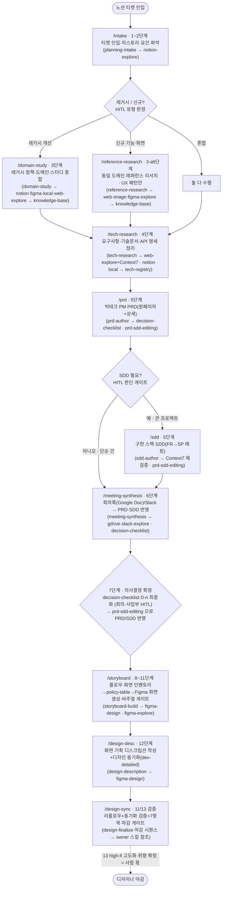

# product-planning

PM/PD 기획 워크플로우 자동화 플러그인. **산출물은 현재 작업 디렉토리(워크스페이스)** 에 생성되고, 템플릿/설정은 `${CLAUDE_PLUGIN_ROOT}` 에서 읽습니다.

## 워크플로우 (도구 ↔ 작업 매핑)

각 도구가 어떤 워크플로우 작업을 맡는지와 **인입 후 레거시/신규 분기**입니다. 사각 노드는 `커맨드 · 단계 (사용 스킬)`. 1~6단계(기획) → 7단계(의사결정 확정) → 8~13단계(디자인: 스토리보드·디스크립션·동기화)까지 모두 구현돼 있으며, 13단계 high-fi 취향 확정만 사람 몫입니다.



## 커맨드
| 커맨드 | 단계 | 설명 |
|---|---|---|
| `/new-planning <티켓-URL>` | 1~5 | 인입→(유형 분기)리서치→PRD/(조건부)SDD 전체 파이프라인 |
| `/intake <티켓-URL>` | 1~2 | 티켓 인입·파싱 + 레거시/신규 유형 판정 |
| `/domain-study` | 3 | (레거시) 레거시 정책·도메인 종합 |
| `/reference-research` | 3-alt | (신규) 동일 도메인 레퍼런스 분석 — UI 학습 금지·UX 패턴만 |
| `/tech-research` | 4 | 요구사항·기술 문서·API 명세 정리 |
| `/prd` | 5 | 빅테크 PM 방법론 PRD(원페이저+상세+의사결정 체크리스트) |
| `/sdd` | 5 | (게이트 통과 시) SDD 작성 |
| `/meeting-synthesis` | 6 | 회의록(Google Doc)/Slack 스레드 → PRD/SDD 반영 |
| `/storyboard` | 8~11 | 플로우·화면 인벤토리 → policy-table → Figma 화면 생성·TO-BE 반영·비주얼 게이트 |
| `/design-desc` | 12 | 화면 기획 디스크립션 작성 + 디자인 동기화(개발 착수용 dev-detailed) |
| `/design-sync` | 11/13 | 리플로우 + 디스크립션↔디자인 동기화 검증 + 7항목 마감 게이트 |

## 스킬
- **워크플로우(오케스트레이션)**: `planning-intake` · `domain-study` · `reference-research` · `tech-research` · `prd-author` · `sdd-author` · `meeting-synthesis`
- **디자인 실현(8~13)**: `storyboard-build`(스토리보드 오케스트레이션) · `design-description`(디스크립션+동기화) · `figma-design`(Figma 쓰기 단일 방법론) · `design-finalize`(마감 시퀀스 공용 단일 소스 — 리플로우→hug→겹침→7항목 검수→동기화, 방법은 owner 스킬 참조). 디자인 단계의 Figma "읽기"는 아래 공용 `figma-explore`·`image-explore` 를 그대로 재사용.
- **소스별 읽기(7종)**: `notion-explore` · `figma-explore` · `local-source-ingest` · `web-explore` · `image-explore` · `slack-explore` · `gdrive-explore`
- **공용**: `knowledge-base`(파일 KB 쓰기) · `decision-checklist`(기획·디자인 공백→추천안→최종결정, 같은 스키마 공유·영향 기준 분기) · `prd-sdd-editing`(편집 불변식·디자인 단계 편집 포함)

(커맨드 없이도 대화 중 관련 작업이면 자동 트리거됩니다.)

## 서브에이전트
`research-agent` — 노션/Figma/로컬/웹 자료 격리·병렬 수집(출처 인용, 방법은 읽기 스킬 참조).

## 설정
- 소스 레지스트리: 워크스페이스 `.planning/sources.json` (스키마: [config/sources.example.json](config/sources.example.json))
- SessionStart 훅이 워크스페이스를 감지해 소스/컨벤션을 컨텍스트로 주입하고, **필요한 MCP 커넥터(Notion 필수·Context7 권장·Figma/Slack/Google Drive)와 감지 여부·설치 방법**을 안내합니다.
- MCP는 번들하지 않습니다 — 이미 설치/인증한 커넥터를 그대로 재사용(중복 설치 없음). 미설치 시 `/mcp` 또는 `claude mcp add` 로 추가하세요.

## 산출물 구조 (워크스페이스)
```
engagements/<YYYY-MM>-<slug>/
  00-project-brief.md
  research/{domain-study|reference-research,tech-research}.md  research/meetings/<date>.md
  PRD.md  SDD.md
  design/{flow.md, policy-table.md, logs/}   # 디자인 단계 산출물: 플로우·화면정책(PRD 투영)·빌드/싱크 로그 (디스크립션은 Figma 내 주석)
.planning/knowledge-base/   # 팀 공용 파일 KB: policy-registry·entity-glossary·tech-registry·source-manifest (raw/는 gitignore)
```
